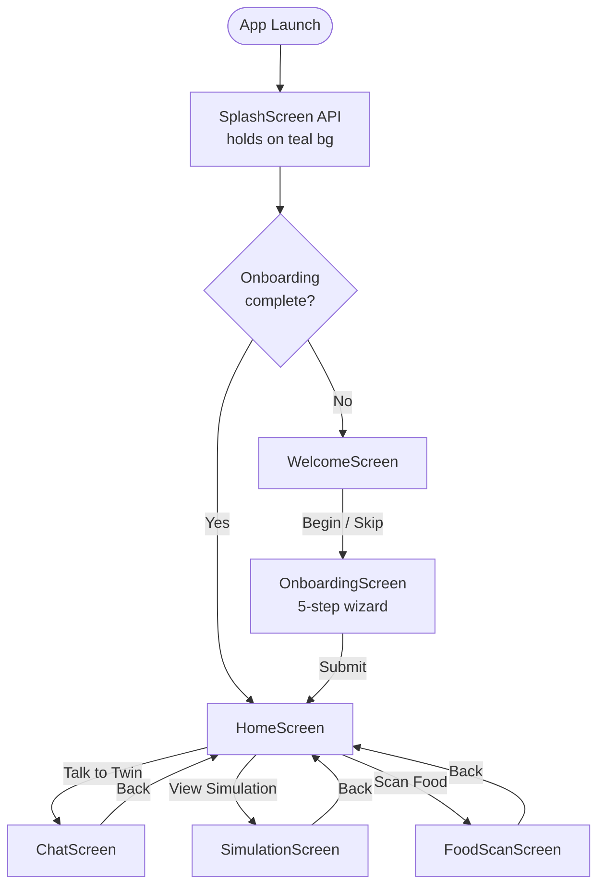

# Navigation

MyTwin uses **AndroidX Navigation Compose** with string-based routes. All routes are defined as constants in the `Routes` object inside `AppNavGraph.kt`.

---

## Route Constants

```kotlin
object Routes {
    const val WELCOME    = "welcome"
    const val ONBOARDING = "onboarding"
    const val HOME       = "home"
    const val CHAT       = "chat"
    const val FOOD_SCAN  = "food_scan"
    const val SIMULATION = "simulation"
}
```

---

## Flow Diagram



---

## Startup Gate

`MainActivity` delays rendering `AppNavGraph` until `RootViewModel` emits a non-null `startDestination`:

```kotlin
val startDestination by vm.startDestination.collectAsStateWithLifecycle()

if (startDestination != null) {
    AppNavGraph(startDestination = startDestination!!)
}
```

`RootViewModel` reads `OnboardingDataSource` via `onboardingRepository.isOnboardingComplete()`. The splash screen is held visible by the `SplashScreen` API until this resolves, so users never see a blank frame.

---

## Back Stack Behavior

| Transition | Back Stack Note |
|---|---|
| Welcome → Onboarding | Welcome is popped (`inclusive = true`) |
| Onboarding → Home | Onboarding is popped |
| Home → Chat / Sim / Food | Pushed onto stack; back returns to Home |

Welcome and Onboarding are removed from the back stack on completion so the user cannot navigate back to them with the system Back gesture.

---

## Navigation Principle

Screens never hold a `NavController` reference. They receive navigation actions as lambda callbacks:

```kotlin
HomeScreen(
    onChatClicked    = { navController.navigate(Routes.CHAT) },
    onFoodScanClicked = { navController.navigate(Routes.FOOD_SCAN) },
    onSimulationClicked = { navController.navigate(Routes.SIMULATION) },
)
```

This keeps screens fully testable in isolation — you can call `HomeScreen` with no-op lambdas in a preview or test.
