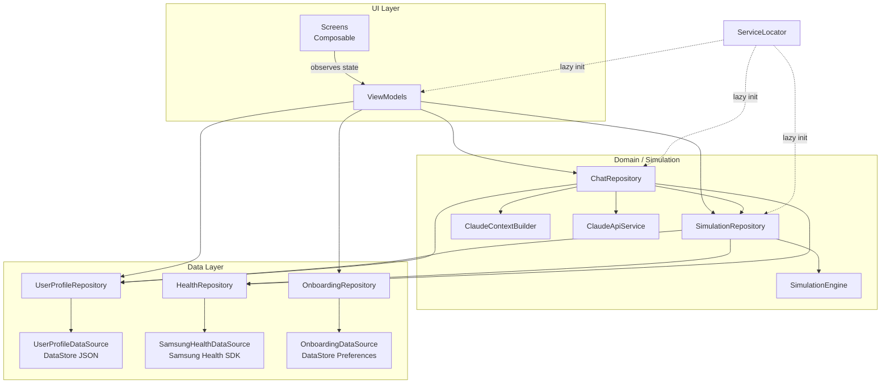

# Architecture Overview

MyTwin follows **MVVM** (Model–View–ViewModel) with a lightweight manual **Service Locator** for dependency wiring. No Hilt or Dagger — the trade-off was deliberate for a 36-hour hackathon: fast setup, zero annotation processing overhead, trivially inspectable.

---

## High-Level Diagram

---

## Layer Responsibilities

| Layer | Package | Purpose |
|---|---|---|
| **Screens** | `ui/screens` | Composable UI, no business logic |
| **ViewModels** | `ui/viewmodels` | UI state holders, coroutine scope owners |
| **Repositories** | `data/repository`, `chat`, `simulation` | Business logic, data aggregation |
| **Data Sources** | `data/datasource` | Raw access to DataStore and Samsung Health SDK |
| **Models** | `data/model`, `simulation`, `chat` | Pure data classes and enums |
| **Service Locator** | `di/ServiceLocator` | Singleton DI container |

---

## Key Design Decisions

### Manual Service Locator over Hilt

`ServiceLocator` is an `object` initialized once in `MyTwinApplication.onCreate()`. Every dependency is a `lazy` val — created on first access. This avoids generated code, annotation processing, and the learning curve of Hilt, which matters when you have 36 hours.

### No XML layouts

Every screen is a Jetpack Compose `@Composable`. `MainActivity` hosts a single `AppNavGraph`. There are no fragments.

### DataStore for persistence

Two DataStore instances:

- **Onboarding flag** — a single boolean Preference
- **User profile** — the full `UserProfile` data class serialized to JSON via `kotlinx.serialization`

### Streaming chat

`ClaudeApiService` opens a raw `HttpURLConnection` to `api.anthropic.com/v1/messages` with `Accept: text/event-stream`. Tokens arrive as SSE `content_block_delta` events and are emitted as a Kotlin `Flow<String>`, which `ChatViewModel` collects into the current message bubble in real time.
