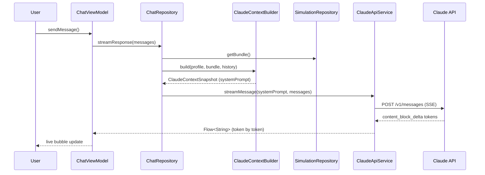

# AI Twin Chat

The Chat screen connects you to **MyTwin** — an AI that speaks as an insightful, grounded version of yourself, not as a generic assistant. It is powered by the **Claude API** with streaming responses.

---

## How It Works



---

## System Prompt

`ClaudeContextBuilder` assembles the system prompt from three sources:

### 1. Persona instructions

```
You are MyTwin, the user's more insightful digital twin.
Speak like an intelligent future version of the user, not like a generic AI assistant.
Sound grounded, calm, practical, and a bit personal without becoming theatrical.
Keep answers concise by default. Usually answer in 2 to 5 short paragraphs or compact bullet points.
```

### 2. Anonymized user context

- Age, biological sex, height, weight
- Smoking, alcohol, diet quality
- Average sleep and steps baselines
- Perceived stress level

No name is included in the context — "digital twin" feels less clinical when it speaks from a shared perspective rather than about "you".

### 3. Simulation baseline + what-if scenarios

The full `SimulationReport` (scores, confidence, narrative) and all five precomputed scenario comparisons are injected as structured text. This lets Claude answer questions like *"what would happen if I slept more?"* with grounded, data-backed answers rather than generic advice.

### 4. Recent wearable history

7-day day-by-day summaries for sleep, steps, heart rate, and stress — formatted as `YYYY-MM-DD:value` pairs.

---

## Streaming

`ClaudeApiService` opens a raw `HttpURLConnection` with:

```
Accept: text/event-stream
```

It parses SSE events line-by-line:

```
event: content_block_delta
data: {"delta": {"type": "text_delta", "text": "Your "}}

event: content_block_delta
data: {"delta": {"type": "text_delta", "text": "recovery "}}
```

Each `text` token is emitted on a `Flow<String>` on `Dispatchers.IO`. `ChatViewModel` collects this flow and appends tokens to the current `ChatMessage.text` in `StateFlow`, so the bubble updates in real time as Claude types.

---

## API Configuration

| Setting | Value |
|---|---|
| Endpoint | `https://api.anthropic.com/v1/messages` |
| Model | Configured via `local.properties` (`claudeModel`) |
| Max tokens | 700 |
| Temperature | 0.6 |
| Stream | `true` |

The API key (`claudeApiKey`) is injected at build time via `BuildConfig` from `local.properties`. It is never committed to source control.

---

## UI

- **Message list** — a `LazyColumn` that auto-scrolls to the latest message
- **Streaming indicator** — while Claude is responding, the bubble shows a "typing…" label below the growing text
- **Input field** — multi-line `OutlinedTextField`, disabled while a response is streaming
- **Error card** — if the API call fails, a dismissable error card appears above the input

---

## Safety Note

The system prompt explicitly frames this as a **coaching-style wellbeing projection, not a diagnosis**:

> *If a question sounds urgent or medical, say professional care is appropriate.*

Claude will not attempt to diagnose conditions or prescribe treatments.
