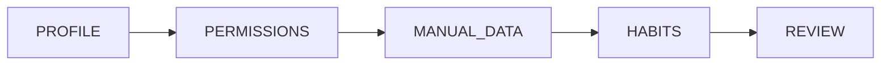

# Onboarding

The onboarding wizard runs exactly once — on first launch. It collects the profile data and health permissions that power every downstream feature.

---

## Wizard Steps

The flow is driven by `OnboardingViewModel` and the `OnboardingStep` enum:

A `LinearProgressIndicator` at the top of the screen shows the user's position. Step transitions use `AnimatedContent` with a fade for a smooth feel.

---

### Step 1 — Profile

Collects basic identity data:

| Field | Input | Validation |
|---|---|---|
| Display name | `OutlinedTextField` | Optional, but shown in greeting |
| Age | `OutlinedTextField` (numeric) | Must be a valid integer |
| Biological sex | `FilterChip` group | Optional |
| Height (cm) | `OutlinedTextField` (numeric) | Must be a valid integer |
| Weight (kg) | `OutlinedTextField` (decimal) | Must be a valid float |

The **Next** button is disabled until `isProfileValid` is true (all numeric inputs parse correctly).

---

### Step 2 — Permissions

Requests access to Samsung Health metrics:

- Sleep
- Steps
- Heart rate
- Stress

Three states can appear:

| State | What the user sees |
|---|---|
| Samsung Health unavailable | Error card + Retry + Skip |
| Policy blocked | Explanation card + Skip |
| Health available | Per-metric status rows + Grant / Continue / Skip |

Each metric row shows its `WearableSignal` state — `ACTIVE`, `DEVICE_PRESENT_NOT_WORN_RECENTLY`, `NO_DEVICE_LIKELY`, or `UNKNOWN`.

!!! info "Why the distinction matters"
    A user can have a wearable but simply not have worn it for a few days. Showing `NO_DEVICE_LIKELY` vs. `DEVICE_PRESENT_NOT_WORN_RECENTLY` prevents the app from wrongly concluding "no device" just because recent sync data is absent.

Permissions are re-checked on `ON_RESUME` via a `LifecycleEventObserver`, so if the user grants permissions in the Samsung Health settings and returns, the step updates automatically.

---

### Step 3 — Manual Data

Conditionally shown sliders for metrics not covered by the wearable:

- **Sleep hours** — shown only if the wearable has no sleep signal
- **Daily steps** — shown only if the wearable has no steps signal
- **Stress level** (1–10) — always shown; wearable stress is a proxy, not a direct measure

If both sleep and steps are already covered by the wearable, the step shows a "You're all covered" card with the representative values read from Samsung Health.

---

### Step 4 — Habits

Collects lifestyle context that has no wearable equivalent:

| Field | Input |
|---|---|
| Smoking status | `FilterChip` group (Never / Former / Occasional / Regular) |
| Alcohol drinks per week | Slider (0–21) |
| Diet quality | `FilterChip` group (Poor / Average / Good / Excellent) |

These values feed directly into the simulation engine's risk scoring.

---

### Step 5 — Review

A summary card showing all collected values before submission. The user can go back and edit any step. Tapping **Create My Twin** calls `vm.submit(onCompleted)`:

1. Saves `UserProfile` to DataStore via `UserProfileRepository`
2. Calls `OnboardingRepository.completeOnboarding()`
3. Navigates to `Routes.HOME` (Welcome and Onboarding are popped from the back stack)

---

## String Localization

All UI strings are in `res/values/strings.xml`. The app is structured for i18n from day one — adding `values-de/` or `values-fr/` requires no code changes.
